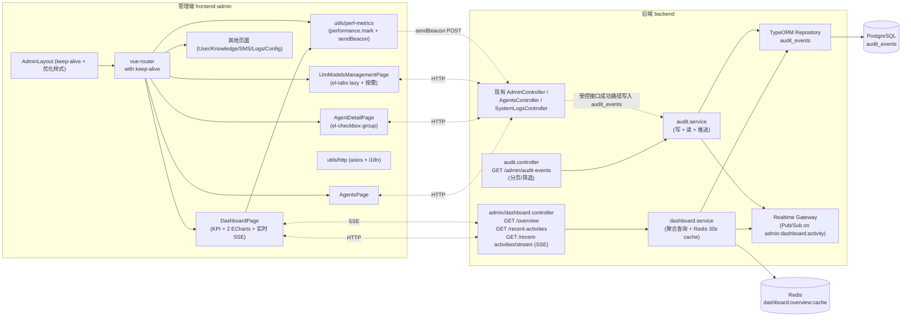

# 管理端体验整改（260714-fix-admin-experience）

Feature Name: admin-experience-fix
Spec Version: 260714
Status: Draft
Owner: Admin Frontend Team
Updated: 2026-07-14

## 1. Description

本设计针对需求文档 `.monkeycode/specs/260714-fix-admin-experience/requirements.md` 中 14 条需求给出落地方案，覆盖 5 个工作包：

- 工作包 B（先做）：智能体详情页 SFC 编译报错修复 + 编辑保存链路修复 + 创建跳转修复；
- 工作包 A：仪表盘实时数据（含新建 `audit_events` 轻量表 + SSE 实时推送）；
- 工作包 C：LLM 模型管理页性能；
- 工作包 D：管理端切页性能（EP 按需 + ECharts 按需 + keep-alive + 样式优化）；
- 工作包 E：前端性能埋点。

技术栈：Vue 3.4 + Vite 5 + Element Plus 2.7 + Pinia + vue-router 4；后端 NestJS 10 + TypeORM + Bull/Redis + 已有 `realtime` 网关（基于 socket.io 但本特性用 SSE 即可，不需要 socket 双通道）。

## 2. Architecture

整体架构改动如下，新增部分以高亮显示：



关键决策：
1. **实时通道选 SSE 而非 WebSocket**：仅做单向推送 + 用 fetch（带 `Accept: text/event-stream`）做订阅即可，避免引入新协议鉴权与重连逻辑；浏览器原生支持、自动重连。
2. **`audit_events` 表独立于 `system_logs`**：日志关注 API 调用级（已有），审计关注业务事件级（本期新增），落地职责分离。
3. **dashboard 概览走 Redis 30s 缓存**：避免每分钟轮询时反复触发大聚合 SQL。

## 3. Components and Interfaces

### 3.1 后端模块

| 模块路径 | 类 / 文件 | 说明 |
|---|---|---|
| `backend/src/modules/admin/dashboard.controller.ts` | `AdminDashboardController` | 提供 `/admin/dashboard/overview`、`/admin/dashboard/recent-activities`（REST）、`/admin/dashboard/recent-activities/stream`（SSE） |
| `backend/src/modules/admin/dashboard.service.ts` | `AdminDashboardService` | 聚合 KPI/趋势/平台分布、最近活动、概览缓存 |
| `backend/src/modules/admin/audit.controller.ts` | `AdminAuditController` | 提供 `GET /admin/audit-events`（分页、筛选、按时间倒序） |
| `backend/src/modules/admin/audit.service.ts` | `AdminAuditService` | 写入工具方法 `record(actor, module, action, resource, extra)`；读取、按时间倒序；推送至 realtime channel |
| `backend/src/database/entities/audit-event.entity.ts` | `AuditEvent` | id / tenantId? / actorId / actorType / module / action / resourceType / resourceId / title / content / ip / createdAt；索引在 `createdAt` |
| `backend/src/database/migrations/1700000000000-CreateAuditEvents.ts` | migration | 建表 + 索引 |
| `backend/src/modules/realtime/realtime.gateway.ts` | `RealtimeGateway`（已存在） | 新增 `publishActivity(event)` 方法，向 `admin:dashboard:activity` 频道推 SSE 消息 |

### 3.2 REST 接口契约

`GET /api/admin/dashboard/overview`
```json
{
  "kpis": {
    "usersTotal": 1234,
    "monitorTasks": 12,
    "todaySentiment": 567,
    "pendingAlerts": 3,
    "activeAgents": 4
  },
  "trend7d": [
    { "date": "2026-07-08", "sentiment": 120, "alerts": 12 },
    ...
  ],
  "platformDistribution": [
    { "platform": "weibo", "count": 1048 },
    ...
  ],
  "generatedAt": "2026-07-14T03:00:00.000Z",
  "cacheHit": false
}
```

`GET /api/admin/dashboard/recent-activities?limit=20`
```json
{
  "items": [
    {
      "id": 1001,
      "module": "agents",
      "action": "create",
      "title": "创建智能体：舆情危机公关顾问",
      "content": "管理员 admin 创建了智能体...",
      "type": "primary",
      "createdAt": "2026-07-14T03:00:00.000Z",
      "actionTarget": "/agents/12"
    }
  ]
}
```

`GET /api/admin/dashboard/recent-activities/stream`（SSE）
- 响应 `Content-Type: text/event-stream; charset=utf-8`
- 心跳：`event: ping\ndata: {ts}\n\n`，每 25s；
- 数据事件：`event: activity\ndata: <payload>\n\n`；
- 连接生命周期由 NestJS `@Sse()` 装饰器 + `Observable` 管理；网关断开时停止计时器。

`GET /api/admin/audit-events?page=1&pageSize=20&module=agents&action=create&startDate=...&endDate=...`
- 复用已有分页风格 `{ items, total, page, pageSize }`。

`POST /api/admin/front-metrics`
```json
{ "name": "route-switch", "durationMs": 120, "page": "DashboardPage", "extra": { ... }, "ts": 1752412345678 }
```
- 写入 `system_logs` 新 level（`frontend-perf`），由 `SystemLogsService.create()` 扩展一个 `perf` level。

### 3.3 前端模块

| 路径 | 文件 | 说明 |
|---|---|---|
| `frontend-admin/src/pages/DashboardPage.vue` | 主页面 | 接 overview + SSE + 60s 轮询 |
| `frontend-admin/src/pages/DashboardPage.vue` 的 `useRecentActivities()` | 组合式 | 订阅 SSE，断线 5s 重连 |
| `frontend-admin/src/utils/perf-metrics.ts` | 工具 | `mark(name)` / `measure(name)` / `report(name, durationMs, extra)` |
| `frontend-admin/src/router/index.ts` | 路由 | 给 `Layout` 路由加 `meta.keepAlive: true` 列表 |
| `frontend-admin/src/layouts/AdminLayout.vue` | Layout | 加 keep-alive，调整菜单渲染策略与样式 |
| `frontend-admin/src/pages/AgentDetailPage.vue` | 详情 | 重构 KB 区为 `el-checkbox-group`，增加"保存全部"按钮 |
| `frontend-admin/src/pages/LlmModelsManagementPage.vue` | 模型管理 | `:lazy="true"` + `computed` + 搜索/筛选 |
| `frontend-admin/src/pages/ModelsTable.vue` | 子组件 | `:row-key` + 操作列收拢 |
| `frontend-admin/src/utils/echarts.ts` | 工具 | `createChart(el, type, option)`；按需导入 charts |
| `frontend-admin/src/main.ts` | 入口 | 改 EP 按需 |

### 3.4 前端契约

```ts
// frontend-admin/src/utils/echarts.ts
export function createChart(el: HTMLElement, type: 'line'|'pie'|'bar'|...,
  option: echarts.EChartsOption): echarts.ECharts
export function disposeChart(chart: echarts.ECharts | null): void
```

```ts
// frontend-admin/src/utils/perf-metrics.ts
export function markAndReport(name: string, extra?: Record<string, unknown>): void
export function startMark(name: string): void
export function endMark(name: string): void
```

```ts
// DashboardPage.vue
const events = ref<ActivityItem[]>([])
const es = new EventSource('/api/admin/dashboard/recent-activities/stream', { withCredentials: true })
es.addEventListener('activity', (e) => {
  const a = JSON.parse((e as MessageEvent).data)
  events.value = [a, ...events.value].slice(0, 20)
})
```

## 4. Data Models

### 4.1 `audit_events` 表

| 字段 | 类型 | 备注 |
|---|---|---|
| id | BIGSERIAL PK | |
| tenant_id | BIGINT NULL | 多租户预留 |
| actor_id | BIGINT NULL | 后台用户 ID；未登录场景为 NULL |
| actor_type | VARCHAR(16) NOT NULL DEFAULT 'admin' | `admin` / `user` / `system` |
| module | VARCHAR(32) NOT NULL | `agents` / `llm-models` / `users` / `kb` / `auth` / ... |
| action | VARCHAR(32) NOT NULL | `create` / `update` / `delete` / `enable` / `disable` / `login` / `logout` / ... |
| resource_type | VARCHAR(32) NULL | `agent` / `llm-model` / ... |
| resource_id | BIGINT NULL | |
| title | VARCHAR(128) NOT NULL | 中文短标题，供仪表盘直接展示 |
| content | TEXT NULL | 详情，可空 |
| ip | VARCHAR(64) NULL | |
| created_at | TIMESTAMPTZ NOT NULL DEFAULT NOW() | 索引 |

TypeORM 实体见 `backend/src/database/entities/audit-event.entity.ts`，migration 见同名 migration 文件。

### 4.2 受控事件 payload（Dartboard SSE）

```ts
type ActivityItem = {
  id: number
  module: string
  action: string
  title: string
  content?: string
  type: 'primary' | 'success' | 'info' | 'warning' | 'danger'
  createdAt: string  // ISO
  actionTarget?: string  // 路由
}
```

`type` 映射规则（前端即可完成，前端不做也行，直接由后端组装）：
- agents/create + agents/update → `primary`
- llm-models/test-success → `success`
- llm-models/test-fail → `danger`
- auth/login + auth/logout → `info`
- kb/parse-fail → `warning`

## 5. Correctness Properties

| # | 属性 | 说明 |
|---|---|---|
| CP-1 | `audit_events` 在受控接口成功路径上必有写入 | 通过 service `record(...)` 替代散落的 await 调用点，service 内 try/catch 包住失败仅 warn，不影响主业务 |
| CP-2 | SSE 推送的事件 `id` 与 `audit_events.id` 一致且单调递增 | realtime 网关不再包装新 id，直接转发 |
| CP-3 | `/overview` 返回缓存命中条件 `cacheHit` 准确 | 缓存 key 含 `tenantId+`:overview`，TTL 30 s，过期返回 `cacheHit: false` |
| CP-4 | 前端 KPI 数字与 `cached count`-允许误差 ≤ 1 | KPI 只读不写，不存在一致性问题 |
| CP-5 | keep-alive 命中时 ECharts 实例不被 `dispose` | 通过 `onActivated`/`onDeactivated` 控制；切回时仍能 `getOption()` |
| CP-6 | 详情页保存接口错误时不丢失已填数据 | 表单以 `Object.assign(form, a)` 模式保留，服务端失败不回滚本地 |
| CP-7 | 受控接口 50 QPS 下 `audit_events` 写入吞吐满足 | 在 `record()` 中不引入同步阻塞逻辑；db 索引已加 |

## 6. Error Handling

| 场景 | 处理 |
|---|---|
| `dashboard/overview` 接口超时 | 前端保留上一次数据 + retry silently；UI 不弹错误 |
| SSE `admin:dashboard:activity` 推不出去 | 日志 warn；UI 不感知；下次 `overview` 重新缓存 |
| SSE 客户端断开 | 浏览器原生重连；手动 catch 关闭后 5s 重连 |
| `audit_events` 写入失败 | `warn` 日志 + 不影响主业务响应；监控告警，由另一条独立 health check 指标上报 |
| 创建智能体返回缺 `id` | 前端弹错误并停留；后端不改字段名以保持与现有 swagger 一致 |
| `AgentDetailPage.vue` 仍有 SFC 错误 | 修复后用 `pnpm run build` + 浏览器 console 验证；保留 `<ErrorBoundary>` 兜底（轻量错误页组件） |
| EP 按需引入漏注册某个组件 | 该组件渲染时报错；通过 e2e smoke 覆盖：`/dashboard`、`/agents`、`/agents/new`、`/llm-models` 四个路径必须 console 无 warn |
| keep-alive 切回导致 store 状态陈旧 | 关键 store 在 `onActivated` 中重新拉取 |

## 7. Test Strategy

### 7.1 单元 / 集成（后端）
- `audit.service.spec.ts`：record+read 闭环；按 module/action 过滤；时间倒序索引命中（EXPLAIN）。
- `dashboard.service.spec.ts`：overview 在 mock 数据下能产出期望的 kpi/trend/platform 结构。
- `audit-events.controller.integration.spec.ts`：`GET /admin/audit-events` 分页与筛选。

### 7.2 e2e（前端，按路径 smoke）
1. 登录 → 进入 `/dashboard`：≤ 2 s 看到 ≥ 1 条真实事件；60 s 内新增事件可见；切到其他页面再切回，图表不闪烁。
2. 进入 `/agents/new`：无编译错误；填入基础配置保存 → 跳转 `/agents/:id` → 进入"知识库"标签能勾选保存。
3. 进入 `/llm-models`：100 条模型下，首屏 ≤ 800 ms；切 6 次 tab，sticky 切回"全部"再切出，渲染时长 ≤ 100 ms。
4. 进入 `/users` → 回到 `/dashboard`：图表保留；不出现"图表重新初始化"日志。
5. Lighthouse Performance 评分：管理端首屏 Performance ≥ 80（dev 环境不强制）。

### 7.3 回归
- 既有管理端功能（用户管理、短信配置、三要素、模型、知识库、SMS 模板、系统日志、AI 智能体列表）回归通过。
- `pnpm -C frontend-admin run build` 成功率 100%，且 `chunks/echarts-*.js` 大小 ≤ 250 KB gzip。
- 错误码体系（`i18n.ts`）：失败响应仍走现有 `http.ts` 拦截器 + errorCode 通知组件，无功能退化。

## 8. References

- [^1]: 当前项目根目录 `/workspace`
- [^2]: ECharts 按需引入官方 — https://echarts.apache.org/handbook/en/basics/import/ （参考 manual import 路径）
- [^3]: Element Plus 按需引入 — https://element-plus.org/en-US/guide/quickstart.html#on-demand-import
- [^4]: NestJS SSE — https://docs.nestjs.com/techniques/server-sent-events
- [^5]: TypeORM Migrations — https://typeorm.io/migrations
- [^6]: 既有 `Realtime Gateway` 文件：`backend/src/modules/realtime/`
- [^7]: 既有 `system-logs` 服务：`backend/src/modules/system-logs/system-logs.service.ts`
- [^8]: Vite manualChunks — https://rollupjs.org/configuration-options/#output-manualchunks
