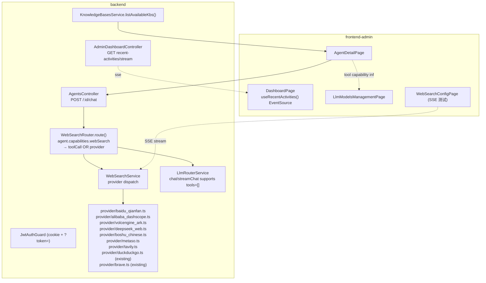

# Design — 管理端第二轮商用整改

Feature Name: admin-v2-round
Spec Version: 260718
Updated: 2026-07-14
Status: Draft

---

## 1. Description

承接 260716 之后的用户反馈。这一轮解决 5 类问题：仪表盘 SSE「实时连接断开」、LLM 配置页崩溃、知识库可见性、搜索引擎 Provider 扩展、测试实时日志展示。

技术要点：
- SSE 鉴权改为 Cookie + `?token=` 双通道
- app.config.errorHandler + window.error + unhandledrejection 三重保护
- 知识库 listAvailableKbs 强转 number
- WebSearchRouter 双通道：模型原生 tool 调用 vs 外部 Provider
- WebSearch.testStream 改用 SSE 推送步骤日志

---

## 2. Architecture



---

## 3. Data Models

### 3.1 web_search_configs 扩展

在 `WebSearchProvider` 枚举加入新成员：
```ts
export type WebSearchProvider =
  | 'duckduckgo'
  | 'brave'
  | 'baidu_qianfan'
  | 'alibaba_dashscope'
  | 'volcengine_ark'
  | 'deepseek_web'
  | 'boshu_chinese'
  | 'metaso_wenshu'
  | 'tavily';
```

DB 字段 `provider` ENUM 同步扩展（migration）。

### 3.2 llm_models.capabilities 新增 keys

现有 `{vision, reasoning, webSearch}` 三个 bool。新增 `toolSupported.webSearch?: boolean` 标识模型原生 web 工具能力。新格式存为：
```json
{
  "vision": false,
  "reasoning": false,
  "webSearch": false,
  "toolSupported": { "webSearch": true }
}
```

### 3.3 migration `1700000060000-ExpandWebSearchProviders.ts`
- 修改 `web_search_configs.provider` 枚举（如 MySQL ENUM 限制需迁移为 VARCHAR(32) + CHECK）
- 添加 `llm_models.toolSupported` JSON 字段

---

## 4. Components and Interfaces

### 4.1 后端

| 路径 | 类 | 变更 |
|---|---|---|
| `backend/src/common/guards/jwt-auth.guard.ts` | JwtAuthGuard | 双通道鉴权：cookie > Authorization > `?token=` |
| `backend/src/modules/admin/web-search.module.ts` | imports | JwtModule + new providers |
| `backend/src/modules/admin/web-search.service.ts` | service | dispatch 到各 Provider；失败抛 `WebSearchProviderError` |
| `backend/src/modules/admin/web-search.controller.ts` | controller | `POST /test-stream` SSE；`provider` 列表接口 |
| `backend/src/modules/admin/web-search.providers/{baidu_qianfan,alibaba_dashscope,...}.ts` | 8 个 provider 实现 | 复用现有 DuckDuckGoProvider 模板 |
| `backend/src/modules/admin/web-search.router.ts` | router | `route(agent, ctx)` 决策器 |
| `backend/src/modules/agents/llm-models.service.ts` | service | `inferToolCapabilities(provider, model)` 推断 + 预设 catalog |
| `backend/src/modules/agents/llm-router.service.ts` | router | `chat`/`streamChat` 接 `tools?: ToolDef[]`，返回 `tool_calls` 时再调 |
| `backend/src/modules/agents/agents.service.ts` | service | chat 入口接 WebSearchRouter.route()；内置模型 tool call 路径 |
| `backend/src/modules/agents/agents.module.ts` | imports | AdminModule（已含 WebSearchModule） |

### 4.2 前端

| 路径 | 文件 | 变更 |
|---|---|---|
| `frontend-admin/src/composables/useRecentActivities.ts` | composable | SSE 携带 token via query，监听 error 事件 |
| `frontend-admin/src/utils/http.ts` | util | 不变（auth header 自动带上） |
| `frontend-admin/src/main.ts` | main | app.config.errorHandler + window.onerror + unhandledrejection 已就位 |
| `frontend-admin/src/pages/AgentDetailPage.vue` | Page | KB list 提前加载 + Number 防御；新增 capabilities 联动 |
| `frontend-admin/src/pages/WebSearchConfigPage.vue` | Page | 测试改为 EventSource + 流式 timeline |
| `frontend-admin/src/composables/useWebSearchTest.ts` | composable | SSE 流式接收 |

### 4.3 接口契约

`GET /api/admin/web-search/providers`（新增）
```json
[
  { "value": "duckduckgo", "label": "DuckDuckGo（免 key）", "builtin": true },
  { "value": "brave", "label": "Brave Search API", "builtin": false },
  { "value": "baidu_qianfan", "label": "百度千帆 BaiduSearch", "builtin": false },
  { "value": "alibaba_dashscope", "label": "阿里云百炼 web_search", "builtin": false },
  { "value": "volcengine_ark", "label": "火山方舟 联网插件", "builtin": false },
  { "value": "deepseek_web", "label": "DeepSeek 内置联网版", "builtin": false },
  { "value": "boshu_chinese", "label": "博查中文搜索", "builtin": false },
  { "value": "metaso_wenshu", "label": "秘塔 AI 搜索", "builtin": false },
  { "value": "tavily", "label": "Tavily Search", "builtin": false }
]
```

`POST /api/admin/web-search/test-stream`
- 请求体：`{ query: string; provider?: string }` 不传则用当前 config
- 响应：SSE，事件：`step | result | done | error`
- 心跳 25 s

`POST /api/agents/:id/chat` 响应体新增：
- `source: 'native_tool' | 'web_search_provider' | 'disabled'`
- `warnings?: string[]`

---

## 5. Correctness Properties

| # | 描述 | 验证 |
|---|---|---|
| CP-1 | Dashboard SSE 持续连接 | curl `-N` 25 s 内收到 ≥ 1 ping |
| CP-2 | Dashboard 客户端 ≤ 6 s 内自动重连 | 手测 |
| CP-3 | LLM 配置页反复切 tab 无 unhandled | dev console 0 红 |
| CP-6 | gpt-4o 选 webSearch=true 时走 native tool | curl 看响应 `source:'native_tool'` |
| CP-7 | 未启用任何 provider 时 chat 返回 warnings 含 `WEB_SEARCH_DISABLED` | curl |
| CP-8 | SSE 测试在沙箱失败时 UI ≤ 1 s 显示 | 手测 |

---

## 6. Error Handling

| 场景 | 处理 |
|---|---|
| SSE 401 | 前端显示「未授权 · 请重新登录」停止重连 |
| WebSearch provider HTTP 4xx / 5xx | `errorCode: WEB_SEARCH_PROVIDER_FAILED`，前端 ElMessage |
| WebSearch API key 缺失 | `errorCode: WEB_SEARCH_CONFIG_MISSING:apiKey` |
| Provider 不识别 | `errorCode: WEB_SEARCH_PROVIDER_UNSUPPORTED` |
| LLM tool_call 递归超过 2 轮 | 强制终止，返回 `[Web Search Disabled]` |
| providers ENUM migration 失败 | 写 down migration + 启动时 validate |

---

## 7. Test Strategy

### 后端

- `web-search.providers/*` 单元测试：每个 provider 用 mock fetch 验证签名 / 解析
- `web-search.router.ts` 路由决策单测：agent.capabilities + provider 状态组合
- `agents.service.chat` 集成测试：tool 调用路径与 Provider 调用路径

### 前端

- useRecentActivities 5 分钟生命周期 + error 重连手测
- WebSearchConfigPage EventSource 关闭后 0 漏消息
- AgentDetailPage /agents/2 知识库 tab 至少 1 个已就绪 KB

### e2e

- 仪表盘 5 分钟无「断开」
- LLM 切 7 次 tab 0 红
- AI 智能体详情页 KB 列表与 /knowledge 列表一致
- Web Search 测试 SSE 流式日志展示

---

## 8. References

- [^1]: `.monkeycode/specs/260716-admin-commercial-readiness/requirements.md`
- [^2]: 百度千帆 BaiduSearch Skill — https://console.bce.baidu.com/qianfan/tools/toolsCenter/57d4e765-8af5-4ec0-8f9b-47075ec349e0/detail
- [^3]: 火山方舟 Web Search 工具 — https://www.volcengine.com/docs/82379/1399499
- [^4]: DeepSeek 内置联网 — deepseek-chat 模型原生支持
- [^5]: Element Plus 按需引入基线 — `.monkeycode/specs/260714-fix-admin-experience/design.md`