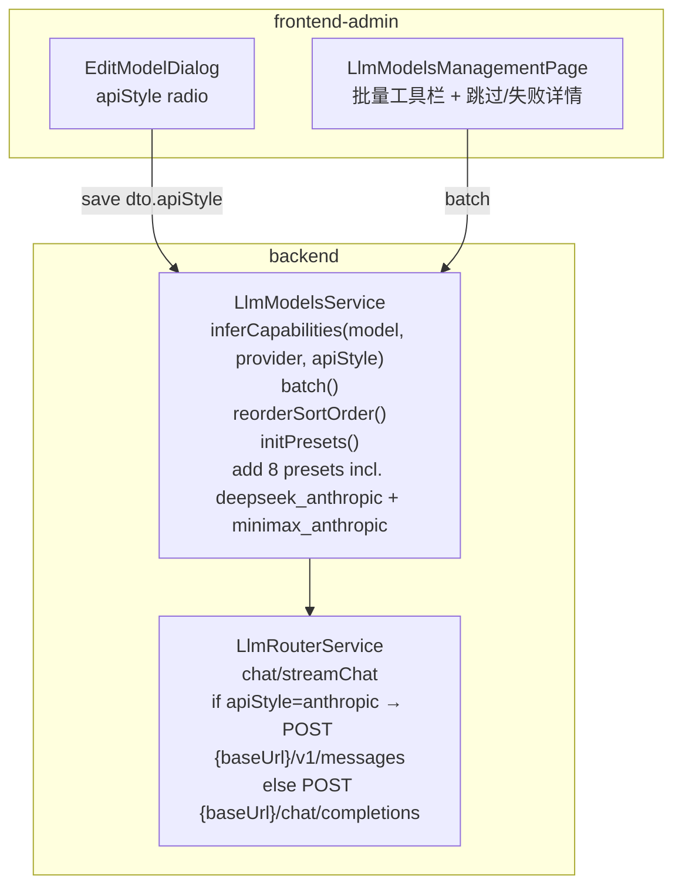

# Design v2 — 管理端 LLM 模型管理升级（Anthropic 兼容）

Feature Name: llm-admin-upgrade-v2
Spec Version: 260718-3
Updated: 2026-07-14

---

## 1. Description

基于 v1 增加 apiStyle 字段（OpenAI 兼容 / Anthropic 兼容），LlmRouterService 实际支持 Anthropic Messages API，扩展 DeepSeek + MiniMax 官方 Anthropic 端点为预置，并按 apiStyle 推断 capabilities。

---

## 2. Architecture



---

## 3. Data Models

### 3.1 `llm_models.api_style`
```sql
ALTER TABLE llm_models
  ADD COLUMN api_style ENUM('openai', 'anthropic') NOT NULL DEFAULT 'openai';
```

migration `1700000080000-AddLlmModelApiStyle.ts`

### 3.2 batch 响应新增 `skipped` 字段
```ts
{
  ok: true,
  successIds: number[],
  failed: Array<{ id: number; errorCode: string; message: string }>,
  skipped: Array<{ id: number; errorCode: string; message: string }>, // 新增
}
```

---

## 4. Components and Interfaces

### 4.1 后端

| 路径 | 类 | 变更 |
|---|---|---|
| `backend/src/modules/agents/llm-models.service.ts` | service | PRESET 加 `deepseek_anthropic`、`minimax_anthropic`；`inferCapabilities(model, provider, apiStyle)` 扩展 M3 推断 |
| `backend/src/modules/agents/llm-router.service.ts` | router | `chat/streamChat` 接受 `apiStyle` 字段；`anthropic` 路径新建 `callAnthropicMessages()` |
| `backend/src/modules/agents/llm-models.controller.ts` | controller | save/update 接受 `apiStyle`；batch 响应补 `skipped` |
| `backend/src/database/migrations/1700000080000-AddLlmModelApiStyle.ts` | migration | 加列 |
| `backend/src/common/errors/business.exception.ts` | error | 新增 `LLM_INVALID_API_STYLE` |

### 4.2 前端

| 路径 | 文件 | 变更 |
|---|---|---|
| `frontend-admin/src/pages/LlmModelsManagementPage.vue` | Page | 编辑对话框加 apiStyle radio；批量结果 ElMessage 三态 |
| `frontend-admin/src/pages/ModelsTable.vue` | SubTable | 状态徽章按 `apiStyle` 显示 provider |

### 4.3 Anthropic Messages API 客户端伪代码

```ts
async function callAnthropicMessages(opts: {
  baseUrl: string; apiKey: string; model: string;
  system?: string; messages: { role: 'user' | 'assistant'; content: string }[];
  maxTokens: number; temperature: number; stream: boolean;
}) {
  const url = `${opts.baseUrl.replace(/\/$/, '')}/v1/messages`;
  const headers: Record<string, string> = {
    'content-type': 'application/json',
    'x-api-key': opts.apiKey,
    'anthropic-version': '2023-06-01',
  };
  if (opts.stream) headers['accept'] = 'text/event-stream';
  const body = {
    model: opts.model,
    max_tokens: opts.maxTokens,
    temperature: opts.temperature,
    system: opts.system || undefined,
    messages: opts.messages,
    stream: opts.stream || undefined,
  };
  // ... fetch / SSE parse
}
```

### 4.4 接口契约（增量）

`PUT /api/admin/llm-models/batch` Response 增 `skipped` 字段（见 3.2）。

---

## 5. Correctness Properties

| # | 描述 |
|---|---|
| CP-12 | `apiStyle=anthropic` 模型 chat 时请求路径 `/v1/messages`、鉴权 `x-api-key` |
| CP-13 | 非法 apiStyle 值 → 422 |
| CP-14 | `GET /admin/llm-models/presets` 返回 8 个 provider |
| CP-15 | seed `minimax_anthropic` 后 M3 `capabilities.vision === true` |
| CP-16 | 批量 50 个无 Key → ElMessage.error "已跳过 50 项无 API Key" |

---

## 6. Error Handling

| 场景 | 处理 |
|---|---|
| 非法 apiStyle | 422 `LLM_INVALID_API_STYLE` |
| Anthropic 端点 401 | LlmRouter 抛 `WEB_SEARCH_FAILED`-like 错误 → agents.service.chat warnings 包含 |
| stream 中断 | 与 OpenAI stream 同一 fallback |

---

## 7. Test Strategy

- Anthropic 端点真实 curl（沙箱不通时 mock 200）
- apiStyle 推断单测
- batch 响应 schema 单测

---

## 8. References

- [^1]: `.monkeycode/specs/260718-llm-admin-upgrade/requirements.md`（v1）
- [^2]: DeepSeek Claude Code 集成 — https://api-docs.deepseek.com/zh-cn/quick_start/agent_integrations/claude_code
- [^3]: MiniMax Anthropic SDK — https://platform.minimax.io/docs/api-reference/text-anthropic-api
- [^4]: Anthropic ↔ OpenAI 协议差异 — https://segmentfault.com/a/1190000047898642