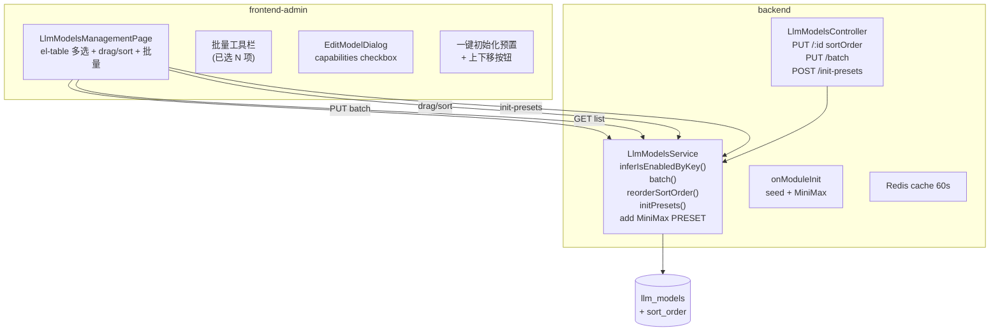

# Design — 管理端 LLM 模型管理升级

Feature Name: llm-admin-upgrade
Spec Version: 260718-2
Updated: 2026-07-14
Status: Draft

---

## 1. Description

承接需求 5 项：API Key 自动推断 is_enabled、批量操作、新增 MiniMax 预置、模型拖拽排序、预置模型治理。落地点为 `frontend-admin/src/pages/LlmModelsManagementPage.vue` + 后端 `LlmModelsService` + `LlmModelsController`。

---

## 2. Architecture



---

## 3. Data Models

### 3.1 新增 `llm_models.sort_order`
```sql
ALTER TABLE llm_models
  ADD COLUMN sort_order INT NOT NULL DEFAULT 0,
  ADD INDEX idx_llm_models_sort (sort_order, id);
```

migration `1700000070000-AddLlmModelSortOrder.ts`

### 3.2 更新 LLM_MODEL_PRESETS（已存在的 seed 数组）

新增 `minimax` provider：
- `displayName: 'MiniMax'`
- `baseUrl: 'https://api.minimax.io/v1'`
- `models`：MiniMax-M3 / M2.7 / M2.7-highspeed / M2.5 / M2.5-highspeed / M2.1 / M2.1-highspeed / M2

### 3.3 后端输出补 `effectiveState` 字段
```ts
{
  ...
  apiKeyConfigured: boolean,
  isEnabled: boolean,
  effectiveState: 'enabled' | 'disabled' | 'disabled_pending_key' | 'enabled_force',
}
```

---

## 4. Components and Interfaces

### 4.1 后端

| 路径 | 类 | 变更 |
|---|---|---|
| `backend/src/modules/agents/llm-models.service.ts` | service | `inferIsEnabledByKey(dto, current)`；batch 批量；reorderSortOrder；initPresets |
| `backend/src/modules/agents/llm-models.controller.ts` | controller | 新增 `PUT /batch`、`POST /init-presets`、单条 `PUT` 接受 `sortOrder` |
| `backend/src/database/migrations/1700000070000-AddLlmModelSortOrder.ts` | migration | 加列加索引 |
| `backend/src/common/errors/business.exception.ts` | error | 新增 `LLM_KEY_REQUIRED` |

### 4.2 前端

| 路径 | 文件 | 变更 |
|---|---|---|
| `frontend-admin/src/pages/LlmModelsManagementPage.vue` | Page | 加 el-table `type="selection"`、@selection-change；批量工具栏；拖拽；"一键初始化"按钮 |
| `frontend-admin/src/pages/ModelsTable.vue` | SubTable | 透传 selection-change 事件；上下移按钮（可选） |
| `frontend-admin/src/utils/dragSortable.ts` | util | sortable 包装（按模型 ID 顺序） |

### 4.3 接口契约

`PUT /api/admin/llm-models/batch`
```json
{ "ids": [1, 2, 3], "isEnabled": true, "force": false }
```
- `force: false`（默认）：只对 `apiKeyConfigured=true` 的行启用
- `force: true`：对所有行启用（管理员已自负责任）

Response:
```json
{ "ok": true, "successIds": [1, 2], "failedIds": [{ "id": 3, "errorCode": "LLM_KEY_REQUIRED" }] }
```

`PUT /api/admin/llm-models/:id` 新增 `sortOrder` 字段（与现有字段共存）。

`POST /api/admin/llm-models/init-presets`
Response:
```json
{ "removed": 2, "added": 25, "keptCustom": 7 }
```

---

## 5. Correctness Properties

| # | 描述 | 验证 |
|---|---|---|
| CP-1 | 未填 Key 保存模型 → isEnabled=0 | curl |
| CP-2 | 填 Key 保存模型 → isEnabled=1 | curl |
| CP-4 | 批量启用 50 个无 Key 模型 → 0 成功 | curl |
| CP-5 | 批量启用 50 个有 Key 模型 → 50 成功 | curl |
| CP-6 | seed 后 presets 含 `minimax` | curl |
| CP-7 | `inferCapabilities('MiniMax-M3').reasoning === true` | node |
| CP-8 | 拖动后 GET 列表新顺序持久化 | curl |
| CP-10 | 删除预置后 GET 列表少一条 | curl |
| CP-11 | init-presets 后所有预置 `is_preset=1` 重新存在 | curl |

---

## 6. Error Handling

| 场景 | 处理 |
|---|---|
| 无 Key 模型被强制启用 | 拒绝并返回 `LLM_KEY_REQUIRED` 错误码 |
| 拖拽到非法位置 | 服务端 `sortOrder` 范围 0..N-1 越界报错 |
| 预置被用户编辑/删除 | 仍可写库；init-presets 才会复位 |
| seed 失败 | 不阻塞启动（`onModuleInit` 已 try/catch） |

---

## 7. Test Strategy

### 后端
- `llm-models.service.spec.ts` 单元：inferIsEnabledByKey 矩阵
- 批量：50 个测试 ID 一次 batch
- sortOrder：dense reorder 边界（首尾 / 中间）

### 前端
- el-table 多选 + selection-change 联调
- 一键初始化按钮确认对话框

### e2e
- 整链路：admin login → /llm-models → 新增预置 → 编辑 → 批量启用

---

## 8. References

- [^1]: `.monkeycode/specs/260716-admin-commercial-readiness/`
- [^2]: `.monkeycode/specs/260718-admin-v2-round/`
- [^3]: MiniMax 文档 — https://platform.minimax.io/docs/llms.txt
- [^4]: MiniMax Anthropic 兼容 API — https://platform.minimax.io/docs/api-reference/text-anthropic-api
- [^5]: MiniMax API Key — https://platform.minimax.io/user-center/basic-information/interface-key
- [^6]: Vue.Draggable — https://github.com/SortableJS/vue.draggable.next