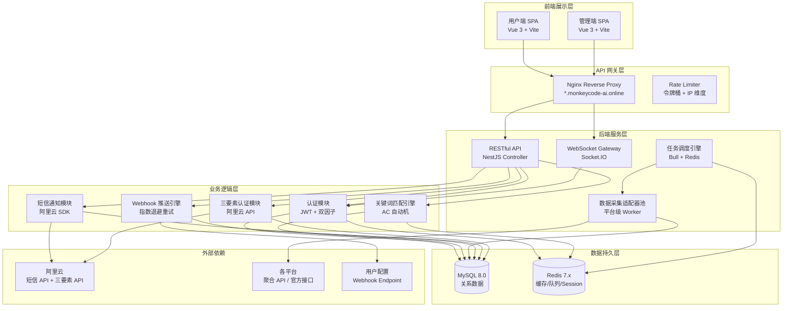
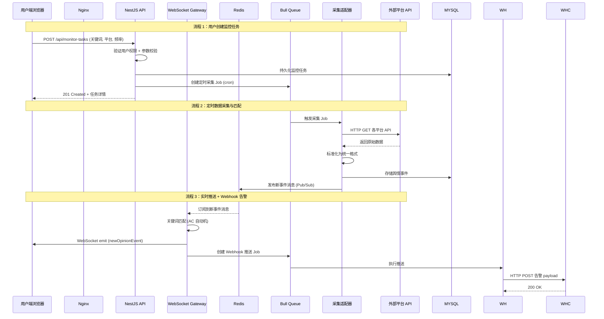
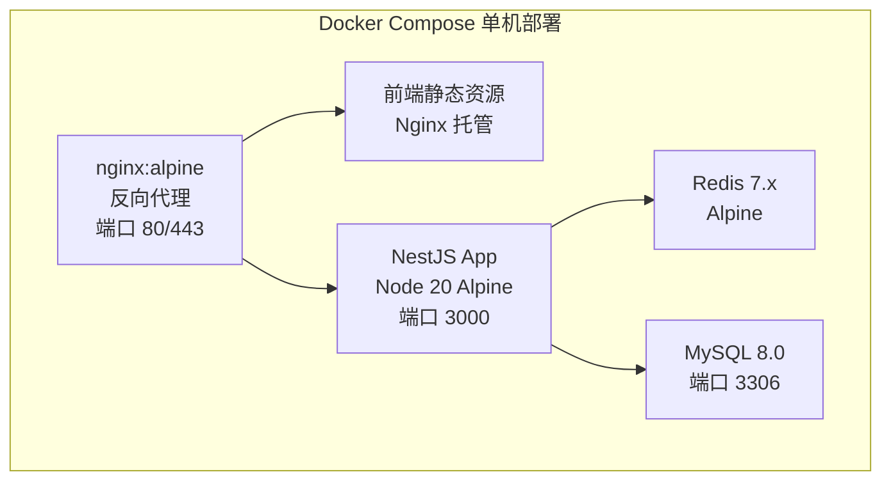

# 全网舆情监测系统 - 技术设计文档

Feature Name: public-opinion-monitor
Updated: 2026-07-13

## 描述

全网舆情监测系统是一个前后端分离的实时舆情数据采集、监控、告警与可视化平台。系统采用 B/S 架构，分为管理端（面向超级管理员）和用户端（面向认证用户），通过混合数据采集模式对接微信公众号、视频号、抖音、小红书、快手、微博、百家号等平台。核心业务流为：数据采集适配器层 → 关键词匹配引擎 → WebSocket 实时推送大屏 + Webhook 告警推送 + 短信通知。

## 架构

### 分层架构图



### 模块通信架构



## 组件和接口

### 1. 前端组件架构

管理端和用户端为两个独立 Vue 3 SPA，共享部分业务组件库。

#### 管理端路由

| 路径 | 组件 | 权限 | 说明 |
|------|------|------|------|
| `/login` | LoginPage | 公开 | 管理员登录 |
| `/dashboard` | AdminDashboard | admin | 管理首页看板 |
| `/users` | UserManagement | admin | 用户管理（分页/搜索/封禁/解封） |
| `/config/aliyun` | AliyunConfig | admin | 阿里云短信 + 三要素配置 |
| `/config/system` | SystemConfig | admin | 系统参数配置 |
| `/logs` | SystemLogs | admin | 操作日志和错误日志 |

#### 用户端路由

| 路径 | 组件 | 权限 | 说明 |
|------|------|------|------|
| `/login` | LoginPage | 公开 | 用户登录 |
| `/register` | RegisterPage | 公开 | 用户注册（短信验证） |
| `/verify` | VerifyPage | 未认证用户 | 三要素认证 |
| `/dashboard` | UserDashboard | 已认证 | 用户首页 |
| `/monitor-tasks` | TaskList | 已认证 | 监控任务列表/创建/编辑 |
| `/monitor-tasks/:id` | TaskDetail | 已认证 | 单个任务详情 + 舆情列表 |
| `/webhooks` | WebhookList | 已认证 | Webhook 机器人管理 |
| `/webhooks/create` | WebhookForm | 已认证 | 创建/编辑 Webhook |
| `/realtime` | RealtimeScreen | 已认证 | 实时舆情大屏 |
| `/profile` | ProfilePage | 已认证 | 个人资料和设置 |

#### 核心共享组件

| 组件名 | 用途 |
|--------|------|
| DataTable | 通用分页表格，支持排序和列自定义 |
| RealTimeChart | 基于 ECharts 的实时曲线/饼图/柱状图组件 |
| PlatformTag | 平台标识标签组件 |
| SentimentBadge | 情感倾向徽标（正面/负面/中性） |
| WebhookTestButton | Webhook 连通性测试按钮 |
| KeywordInput | 关键词输入组件（支持精确匹配/通配符/排除词） |

### 2. 后端 API 接口设计

#### 认证模块

| 方法 | 路径 | 说明 |
|------|------|------|
| POST | `/api/auth/login` | 登录，返回 JWT Token |
| POST | `/api/auth/register` | 注册（需短信验证码） |
| POST | `/api/auth/change-password` | 修改密码（用于首次登录强制修改） |
| POST | `/api/auth/reset-password` | 忘记密码重置 |
| POST | `/api/auth/send-sms-code` | 发送短信验证码（Body: phone, scene: login\|register\|reset） |
| POST | `/api/auth/refresh-token` | 刷新 JWT Token |

#### 管理端接口

| 方法 | 路径 | 说明 |
|------|------|------|
| GET | `/api/admin/users` | 分页获取用户列表（search, status, dateRange） |
| PUT | `/api/admin/users/:id/ban` | 封禁用户 |
| PUT | `/api/admin/users/:id/unban` | 解封用户 |
| GET | `/api/admin/config/aliyun-sms` | 获取阿里云短信配置（脱敏） |
| PUT | `/api/admin/config/aliyun-sms` | 更新阿里云短信配置 |
| GET | `/api/admin/config/aliyun-verify` | 获取阿里云三要素配置（脱敏） |
| PUT | `/api/admin/config/aliyun-verify` | 更新阿里云三要素配置 |
| GET | `/api/admin/config/test-sms` | 发送测试短信验证配置 |
| GET | `/api/admin/dashboard/stats` | 管理端首页统计 |
| GET | `/api/admin/system/logs` | 系统日志列表 |

#### 用户端监控任务接口

| 方法 | 路径 | 说明 |
|------|------|------|
| GET | `/api/monitor-tasks` | 当前用户所有监控任务列表 |
| POST | `/api/monitor-tasks` | 创建监控任务 |
| GET | `/api/monitor-tasks/:id` | 单个任务详情 |
| PUT | `/api/monitor-tasks/:id` | 更新任务配置 |
| DELETE | `/api/monitor-tasks/:id` | 删除任务 |
| PUT | `/api/monitor-tasks/:id/toggle` | 启用/暂停任务 |
| GET | `/api/monitor-tasks/:id/events` | 任务关联的舆情事件列表（分页） |

#### Webhook 管理接口

| 方法 | 路径 | 说明 |
|------|------|------|
| GET | `/api/webhooks` | 当前用户所有 Webhook 列表 |
| POST | `/api/webhooks` | 创建 Webhook 机器人 |
| GET | `/api/webhooks/:id` | 单个 Webhook 详情 |
| PUT | `/api/webhooks/:id` | 更新 Webhook 配置 |
| DELETE | `/api/webhooks/:id` | 删除 Webhook |
| POST | `/api/webhooks/:id/test` | 发送测试消息验证连通性 |
| GET | `/api/webhooks/:id/logs` | Webhook 推送日志 |

#### Webhook 数据接入接口

| 方法 | 路径 | 说明 |
|------|------|------|
| POST | `/api/webhook-ingest/:token` | 第三方通过 Webhook 推送舆情数据（token 为用户生成的接入令牌） |

#### 三要素认证接口

| 方法 | 路径 | 说明 |
|------|------|------|
| POST | `/api/verify/real-name` | 提交三要素认证信息 |
| GET | `/api/verify/status` | 查询当前用户认证状态 |

#### WebSocket 事件

| 事件名 | 方向 | 说明 |
|--------|------|------|
| `opinion:new` | Server → Client | 新舆情事件推送（大屏实时更新） |
| `opinion:stats` | Server → Client | 统计数据推送（每 5 秒一次） |
| `task:status` | Server → Client | 监控任务状态变更通知 |
| `webhook:status` | Server → Client | Webhook 推送状态变更通知 |
| `subscribe:tasks` | Client → Server | 订阅特定监控任务的事件流 |
| `unsubscribe:tasks` | Client → Server | 取消订阅 |

### 3. 数据采集适配器接口

所有平台适配器实现统一接口：

```typescript
interface PlatformAdapter {
  readonly platform: PlatformType; // weixin | douyin | xiaohongshu | kuaishou | weibo | baijiahao
  readonly displayName: string;

  // 根据关键词获取最近舆情
  fetchByKeywords(
    keywords: string[],
    options: FetchOptions
  ): Promise<RawOpinionEvent[]>;

  // 健康检查
  healthCheck(): Promise<HealthStatus>;
}
```

适配器返回原始数据后，系统中立化模块将其转换为统一舆情事件格式：

```typescript
interface OpinionEvent {
  id: string;
  platform: PlatformType;
  title: string;
  content: string;
  summary: string;          // 自动摘要（最长 200 字）
  author: string;
  authorAvatar?: string;
  publishTime: string;      // ISO 8601
  url: string;              // 原文链接
  readCount: number;
  likeCount: number;
  commentCount: number;
  shareCount: number;
  sentiment: Sentiment;     // positive | negative | neutral
  keywords: string[];       // 命中的关键词列表
  rawData: Record<string, unknown>; // 原始数据留痕
  matchedAt: string;        // ISO 8601 匹配时间
}
```

## 数据模型

### MySQL 核心表设计

```mermaid
erDiagram
    users {
        bigint id PK
        varchar username UNIQUE
        varchar password_hash
        varchar phone UNIQUE
        varchar real_name "可空，认证后填写"
        varchar id_card_hash "可空，身份证 SHA256"
        enum auth_status "unverified | verified | banned"
        enum role "admin | user"
        tinyint first_login "是否首次登录"
        int login_attempts "失败次数"
        datetime locked_until "锁定到何时"
        datetime last_login_at
        datetime created_at
        datetime updated_at
    }

    aliyun_configs {
        bigint id PK
        varchar config_type "sms | real_name_verify"
        varchar access_key "AES-256-CBC 加密"
        varchar secret_key "AES-256-CBC 加密"
        varchar sign_name "短信签名，sms 类型时使用"
        varchar template_code "短信模板 code"
        varchar product_code "三要素产品 code"
        datetime created_at
        datetime updated_at
    }

    monitor_tasks {
        bigint id PK
        bigint user_id FK
        varchar name "任务名称"
        text keywords "JSON 数组，如 ["AI","大模型"]"
        text exclude_keywords "排除词"
        json platforms "["weixin","douyin","weibo"]"
        enum match_mode "exact | fuzzy | both"
        enum sentiment_filter "all | positive | negative"
        int min_read_threshold "最低阅读量"
        int min_like_threshold "最低点赞量"
        enum frequency "5min | 15min | 30min | 60min"
        enum status "enabled | paused | error"
        datetime last_run_at
        datetime created_at
        datetime updated_at
    }

    opinion_events {
        bigint id PK
        bigint task_id FK
        varchar platform
        varchar title
        text content
        text summary
        varchar author
        varchar author_avatar
        datetime publish_time
        varchar url
        int read_count
        int like_count
        int comment_count
        int share_count
        enum sentiment
        json matched_keywords
        json raw_data
        int status "0=正常 1=已删除"
        datetime matched_at
        datetime created_at
        INDEX idx_task_time (task_id, matched_at)
        INDEX idx_publish_time (publish_time)
    }

    webhooks {
        bigint id PK
        bigint user_id FK
        varchar name
        varchar url
        enum format "wecom | dingtalk | feishu | custom_json"
        varchar secret_key "可选签名密钥"
        tinyint push_on_match "命中即推"
        tinyint push_periodic "定时推送"
        enum periodic_freq "hourly | every_6h | daily"
        varchar periodic_time "定时推送时间 HH:mm"
        datetime last_push_at
        enum status "active | error | disabled"
        datetime created_at
        datetime updated_at
    }

    webhook_task_bindings {
        bigint id PK
        bigint webhook_id FK
        bigint task_id FK
        enum status "active | inactive"
        datetime created_at
        UNIQUE (webhook_id, task_id)
    }

    webhook_push_logs {
        bigint id PK
        bigint webhook_id FK
        bigint event_id FK "可空，定时推送时为空"
        int http_status
        text response_body
        int retry_count
        enum result "success | failed | timeout"
        decimal duration_ms
        datetime created_at
    }

    sms_logs {
        bigint id PK
        varchar phone
        enum scene "login | register | reset | notify | alert"
        varchar template_code
        enum status "sent | success | failed"
        varchar error_code
        varchar error_message
        datetime created_at
        INDEX idx_phone_time (phone, created_at)
    }

    system_logs {
        bigint id PK
        bigint operator_id "可空，系统操作时为空"
        enum level "info | warn | error"
        varchar module
        varchar action
        text detail
        varchar ip_address
        datetime created_at
        INDEX idx_module_time (module, created_at)
    }

    users ||--o{ monitor_tasks : has
    users ||--o{ webhooks : has
    monitor_tasks ||--o{ opinion_events : contains
    monitor_tasks ||--o{ webhook_task_bindings : bound
    webhooks ||--o{ webhook_task_bindings : bound
    webhooks ||--o{ webhook_push_logs : logs
```

### Redis 数据结构

| Key 模式 | 类型 | 用途 | TTL |
|----------|------|------|-----|
| `session:{token}` | String | 用户 JWT Session | 7 天 |
| `sms:code:{phone}:{scene}` | String | 短信验证码 | 5 分钟 |
| `rate:login:{ip}` | String (counter) | 登录频率限制 | 1 分钟 |
| `rate:sms:{phone}` | String (counter) | 短信发送频率限制 | 1 小时 |
| `ws:user:{userId}:tasks` | Set | 用户 WebSocket 关联的任务 ID | - |
| `bull:task-queue:*` | - | Bull 任务队列相关 keys | - |
| `cache:platform:{name}:keywords` | String (JSON) | 各平台活跃关键词缓存 | 30 秒 |
| `pubsub:opinion:new` | Pub/Sub | 新舆情事件广播通道 | - |

### 用户端 Webhook 数据推送格式

**企业微信格式：**
```json
{
  "msgtype": "markdown",
  "markdown": {
    "content": "## 舆情告警\n>**平台**: 微博\n>**关键词**: AI\n>**标题**: [XXX 公司发布最新 AI 产品]\n>**阅读**: 12.3万 | **点赞**: 4567\n>**时间**: 2026-07-13 14:30\n>[查看原文](https://...)"
  }
}
```

**钉钉格式：**
```json
{
  "msgtype": "actionCard",
  "actionCard": {
    "title": "舆情告警 - AI",
    "text": "### 舆情告警\n\n**平台**: 微博\n**关键词**: AI\n**标题**: XXX 公司发布最新 AI 产品\n**阅读**: 12.3万\n**时间**: 2026-07-13 14:30",
    "btnOrientation": "1",
    "singleTitle": "查看原文",
    "singleURL": "https://..."
  }
}
```

**飞书格式：**
```json
{
  "msg_type": "interactive",
  "card": {
    "header": {
      "title": { "tag": "plain_text", "content": "舆情告警" }
    },
    "elements": [
      { "tag": "markdown", "content": "**平台**: 微博\n**关键词**: AI\n**标题**: XXX 公司发布最新 AI 产品\n**阅读**: 12.3万\n**时间**: 2026-07-13 14:30" },
      { "tag": "button", "text": { "tag": "plain_text", "content": "查看原文" }, "url": "https://..." }
    ]
  }
}
```

**自定义 JSON 格式：**
用户可自定义推送 body 模板和请求头，系统通过模板引擎渲染。模板变量：
`{{platform}}` `{{title}}` `{{content}}` `{{summary}}` `{{author}}` `{{publishTime}}` `{{url}}` `{{readCount}}` `{{likeCount}}` `{{commentCount}}` `{{sentiment}}` `{{keywords}}`

## 正确性属性

### 数据一致性

1. 用户数据完全隔离 —— 所有用户查询接口在 SQL 层面强制加 `AND user_id = :userId` 条件，不允许在业务代码层做行级过滤
2. 舆情事件不可变 —— opinion_events 表只插入不更新，数据源变更时追加新记录，保留完整时间线
3. JWT Token 无状态但有黑名单 —— 登出或封禁时将 Token jti 加入 Redis 黑名单，中间件校验时检查黑名单
4. 短信验证码一次性 —— 验证成功后立即删除 Redis 中的 code，防止重复使用

### 幂等性

1. 舆情事件去重 —— 同一 task_id + platform + url + publish_time 的组合在 15 分钟内重复写入时忽略（基于 Redis 布隆过滤器）
2. Webhook 推送幂等 —— 每个推送 job 包含唯一 jobId，Webhook 接收方可用此 Id 做幂等处理
3. 采集任务取消 —— 更新或删除监控任务时，Bull 清理该任务所有待执行的 future jobs

### 实时性

1. 数据采集 → 关键词匹配 → WebSocket 推送 全链路延迟不超过 3 秒（P99）
2. 大屏统计看板每 5 秒刷新一次，通过 Redis Pub/Sub 广播统计更新
3. Webhook 推送失败后指数退避重试（5s → 15s → 45s），总计不超过 1 分钟

## 错误处理

| 场景 | 错误码 | 处理策略 | 用户提示 |
|------|--------|----------|----------|
| 登录验证码错误 | 400 | 递增失败计数，记录日志 | "验证码错误，请重新输入" |
| 短信发送频率超限 | 429 | 拒绝发送，记录日志 | "短信发送过于频繁，请 1 小时后重试" |
| 阿里云配置不完整 | 503 | 返回降级提示，记录告警日志 | "系统配置未完成，请联系管理员" |
| 阿里云 API 调用失败 | 502 | 重试 1 次，失败则记录错误 | "认证服务暂时不可用，请稍后重试" |
| 三要素认证失败 | 422 | 记录具体哪个要素不匹配 | "姓名/身份证号/手机号不匹配，请核对后重试" |
| Webhook URL 不可达 | 200(业务) | 记录推送失败日志，标记异常 | 页面展示"推送异常"状态标签 |
| 监控任务数据源异常 | 200(业务) | 该平台暂停采集，其他平台继续 | "微博数据源异常，已暂停采集" |
| Token 过期 | 401 | 自动刷新或跳转登录 | 前端拦截器统一处理，静默刷新 |
| 用户被封禁 | 403 | 拒绝所有操作请求 | "账号已被封禁，请联系管理员" |
| 数据库连接失败 | 500 | 触发重连，收集错误上下文 | "系统繁忙，请稍后重试" |

## 测试策略

### 单元测试（Jest + Supertest）

| 模块 | 覆盖内容 | 目标覆盖率 |
|------|----------|-----------|
| 认证模块 | 密码加密验证、JWT 签发验证、Token 刷新 | 90%+ |
| 关键词匹配引擎 | 单关键词、多关键词、通配符、排除词、AC 自动机构建 | 95%+ |
| Webhook 推送 | 各格式 payload 生成、签名计算、重试逻辑 | 90%+ |
| 数据适配器 | 各平台数据标准化转换、异常数据处理 | 85%+ |
| 用户权限隔离 | 查询强制 user_id 过滤、跨用户数据不可见 | 100% |

### 集成测试

| 测试场景 | 策略 |
|----------|------|
| 完整登录→认证→创建监控→收到推送 链路 | 端到端测试，模拟完整用户旅程 |
| 阿里云短信 API Mock | nock 模拟阿里云 SDK 返回，验证重试和降级逻辑 |
| WebSocket 推送延迟 | 在 CI 中启动 WebSocket 客户端，记录端到端延迟 |
| 并发的关键词匹配 | 100 个并发关键词任务同时匹配同一批数据，验证 CPU 和内存表现 |

### E2E 测试（Playwright）

| 场景 | 说明 |
|------|------|
| 管理员完整工作流 | 登录 → 配置阿里云 → 查看用户 → 封禁/解封 |
| 用户完整工作流 | 注册 → 三要素认证 → 创建监控任务 → 创建 Webhook → 查看大屏 |
| 实时大屏 | 验证 WebSocket 事件推送后页面数据正确更新 |
| 错误的密码登录 | 验证 5 次失败后锁定提示 |

## 安全设计

1. 密码使用 bcrypt 哈希，cost factor = 12
2. 阿里云 AccessKey/SecretKey 在数据库中使用 AES-256-CBC 加密存储，加密密钥来自环境变量
3. 所有 API 接口强制 HTTPS
4. 前端敏感信息（Token、配置）不存储在 localStorage，仅存于内存变量 + httpOnly cookie
5. 身份证号在数据库中存储 SHA-256 哈希值，不存明文
6. 所有管理端接口在校验 JWT 后额外校验 role === 'admin'
7. API 限流：认证接口 10 次/分钟/IP，其他接口 60 次/分钟/用户
8. XSS 防护：所有用户输入在渲染前进行 HTML 转义

## 部署架构



前端打包为静态文件，由 Nginx 托管。后端 NestJS 通过 PM2 或 Node 直接运行。Bull 任务队列使用 Redis 作为后端。

## 实施阶段建议

| 阶段 | 内容 | 预估周期 |
|------|------|----------|
| P0-MVP | 认证系统 + 管理端用户管理 + 短信配置 + 三要素认证 | 2 周 |
| P1-核心 | 关键词监控任务 CRUD + 数据采集适配器框架 + 标准数据格式化 | 2 周 |
| P2-实时 | WebSocket 大屏 + 关键词匹配引擎 + 实时推送 | 1.5 周 |
| P3-通知 | Webhook 机器人 + 告警推送 + 定时推送 + 短信通知 | 1.5 周 |
| P4-完善 | 数据采集适配器各平台对接 + 系统日志 + 错误处理完善 + 测试 | 2 周 |
| P5-加固 | 性能优化 + 安全审计 + Docker 部署 + 文档 | 1 周 |

## 参考资料

- NestJS 官方文档 - WebSocket Gateways: https://docs.nestjs.com/websockets/gateways
- Bull Queue 官方文档: https://docs.bullmq.io/
- Socket.IO 官方文档: https://socket.io/docs/v4/
- Vue 3 官方文档: https://vuejs.org/guide/introduction.html
- TypeORM 官方文档: https://typeorm.io/
